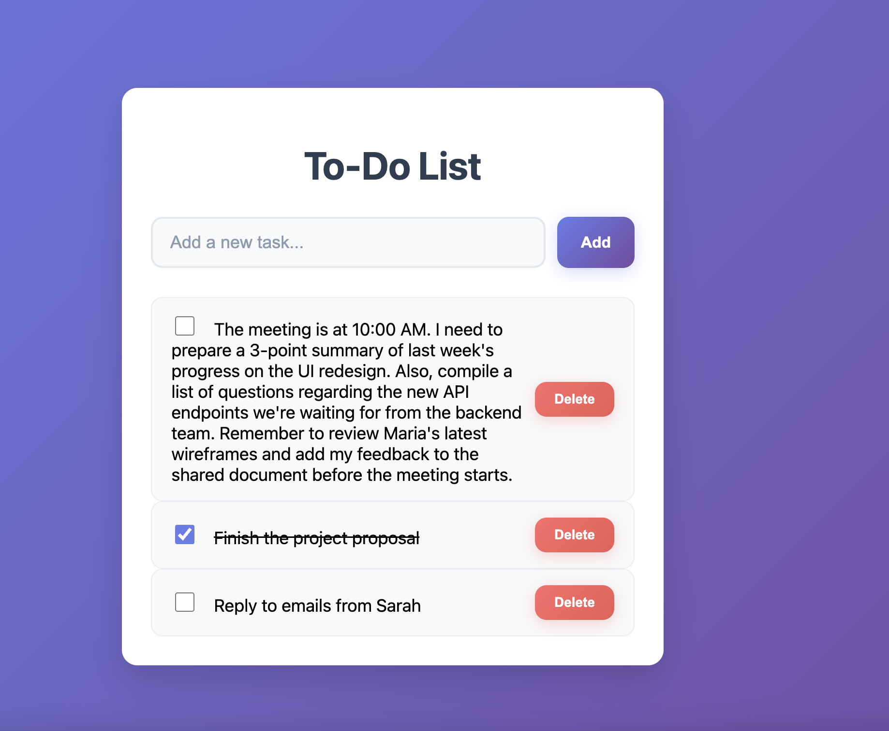

# Todo List Application

A simple full-stack Todo List app built with FastAPI (backend) and React (frontend).


## Features

- Add, update, delete todos
- Mark todos as completed
- View all todos
- RESTful API with FastAPI
- React frontend with TypeScript

---

## Prerequisites

- **Python 3.8+**
- **Node.js 16+** and **npm**
- **pip** (Python package manager)

---

## Backend Setup (FastAPI)

1. **Navigate to backend folder:**
   ```bash
   cd backend
   ```

2. **Create and activate a virtual environment (recommended):**
   ```bash
   python3 -m venv venv
   source venv/bin/activate
   ```

3. **Install dependencies:**
   ```bash
   pip3 install -r requirements.txt
   ```

5. **Run the FastAPI server:**
   ```bash
   uvicorn main:app --reload
   ```
   The API will be available at [http://127.0.0.1:8000](http://127.0.0.1:8000).

---

## Frontend Setup (React)

1. **Navigate to frontend folder:**
   ```bash
   cd frontend
   ```

2. **Install dependencies:**
   ```bash
   npm install
   ```

3. **Start the React development server:**
   ```bash
   npm start
   ```
   The app will be available at [http://localhost:3000](http://localhost:3000).

---

## Usage

- Open [http://localhost:3000](http://localhost:3000) in your browser.
- Add, edit, complete, and delete todos.
- The frontend communicates with the FastAPI backend at [http://127.0.0.1:8000](http://127.0.0.1:8000).

---

## API Endpoints

- `GET /todos` - List all todos
- `POST /todos` - Add a new todo (`{ "title": "Your todo" }`)
- `PUT /todos/{id}` - Update a todo (`{ "title": "New title", "completed": true }`)
- `DELETE /todos/{id}` - Delete a todo

---

## Running Tests

Run all tests from the `backend` directory:

```bash
pytest tests
```

Run all tests from the `frontend` directory:

```bash
npm test -- --watchAll=false
```

---

## Start the application and run tests using Docker

```
docker compose up -d backend frontend
docker compose run --rm backend python -m pytest tests -v
docker compose run --rm frontend npm test -- --watchAll=false 
docker compose down
```

## Notes

- The backend uses in-memory storage (todos are lost when the server restarts).
- For production, consider adding a database (e.g., SQLite, PostgreSQL).
- CORS is enabled for `http://localhost:3000` by default.
- Add authentication (basic)

---

## License

This project is licensed under the MIT License. See the [LICENSE](LICENSE) file for details.